# waph-atmakugh
# WAPH-Web Application Programming and Hacking

## Instructor: Dr. Phu Phung

## Student

**Name**: Atmakuri Ganesh

**Email**: atmakugh@mail.uc.edu

**Short-bio**: A masters student with communication,organizational, and technical skills seeking opportunities. A hand-working and motivated engineering student with authentic skills in user application development and design thinking,dedicated to levaraging my abilities as a capable and diligent student  

 

 
## Lab Overview 

- This lab covers foundation of web.
- As part of this lab there are two parts to be completed.
- Part 1 covers the web and http protocol.
- Part 1 deals with working with wireshark to analyze network packet and understanding of telnet and wireshark.
- Part 2 covers basic web application programming.
- Part 2 requires working with basic CGI application with C. A simple php application and understanding about http GET and POST requests.

## Repository Information

Respository's URL: [https://github.com/ATMAKURIGANESH3009/waph-atmakugh/tree/main/labs/lab1](https://github.com/ATMAKURIGANESH3009/waph-atmakugh/tree/main/labs/lab1)

## PART 1 - The web and http protocol

## Task 1 - Familiar with wireshark tool and Http protocol  

- Wireshark tool is used to analyze the network packets traffic and requests
- To get started, install wireshark with the command *sudo apt-install wireshark-qt*
- After installing wireshark, open it with the command *sudo wireshark &*
- Next we need to click on 4th icon i.e setup icon.
- From here we need to select any and start capturing packets.
- Open the browser and browse to the link example.com 
- Come back to the wireshark and click on stop capturing red icon.
- Apply http filter to see http request and response messages.
- Click on http request GET/index.html
- Analyze the http request message. 
- Similarly, click on response message to analyze http response message 
- Next, right click on http request -> Follow -> http stream to understand http request and response message as it displays protocol streams  

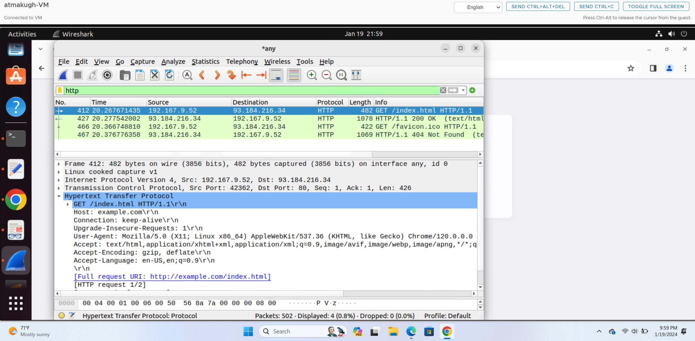 

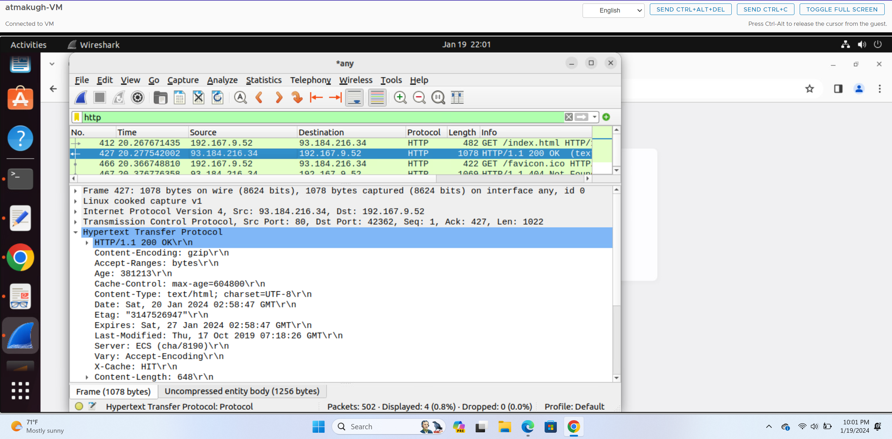 

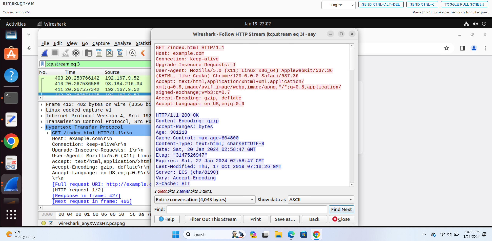 

## Task 2 - Understanding HTTP using telnet and Wireshark

- Telnet is a network protocal used to establish and communicate information between sender and receiver
- In this task, using terminal we will establish and get the http request and response using telnet command
- Before entering the command, go to wireshark and start capturing the packets like in task 1
- Now in terminal, give the command *telnet example 80* 
- If the connection is success, it will prompt to type the commands
   - GET /index.html HTTP/1.0
   - Host: example.com
- Press the enter two times and stop capturing the packets.
- The terminal will display the http request and response from the server. 

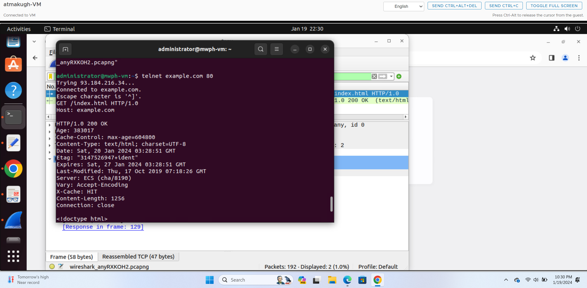 

- Now the task is completed in both the cases with some differences
- After using telnet command, it prompted to enter the GET http request and host name but while through web it read the request automatically. 
- Also, the fields like connection, user-agent, accept, accept-language, encoding are not shown in the terminal.  

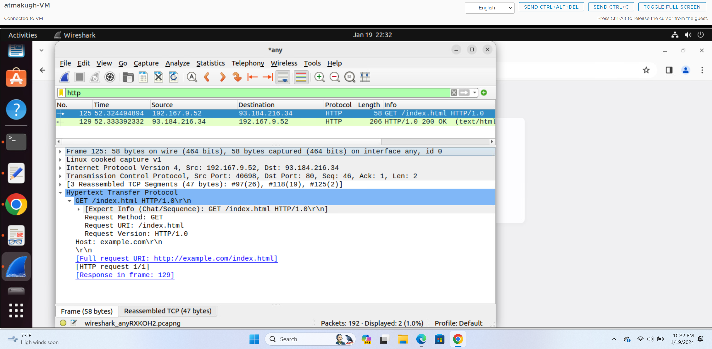 

- There is quite not many differences with the http response message between terminal and web generated.  

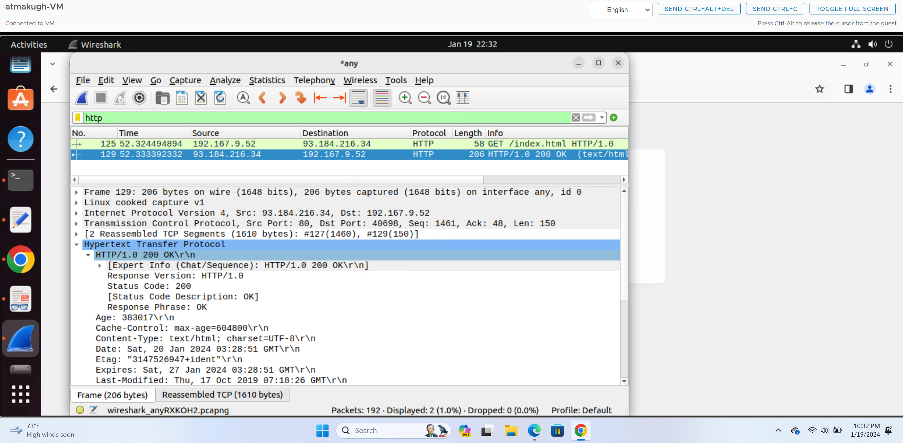 

## PART 2 - Basic web application Programming

## Task 1- CGI web application in C

- a. Writing a cgi program and deploying in the server is easy.
- We need to install gcc first using the command *sudo install gcc* to compile the program
- We need to enable cgi daemon using the command *sudo a2enmod cgid*
- Restart the apache server to track the changes effectively
- Now create a helloworld.c file and write the required code.
- Now compile the file with gcc by giving the command *gcc helloworld.c -o helloworld.cgi
- We can execute the file by giving ./helloworld.cgi
- In order to deploy the cgi file in the browser we neeed to copy the file to the /usr/lib/cgi-bin
- Usually cgi programs stored in this will be invoked by the apache server
- Copy it to deploy the program by giving *sudo cp helloworld.c /usr/lib/cgi-bin* 
- Program: 
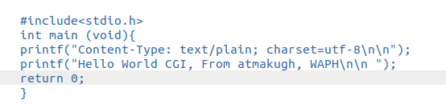 
 

 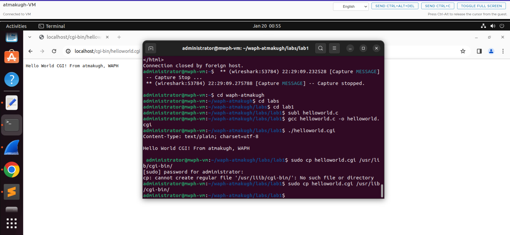 
 
 - b. Writing another C CGI program deploying with html code
 - As in above task, write a C program by embedding html code inside the printf statement
 - Save the file and compile it with *gcc index.c -o index.cgi*
 - Execute the file using *./index.cgi*
 - Copy the file to deploy the program *sudo cp index.cgi /usr/lib/cgi-bin/*
 - Open the browser and enter the localhost to display the application.
 - Program:  
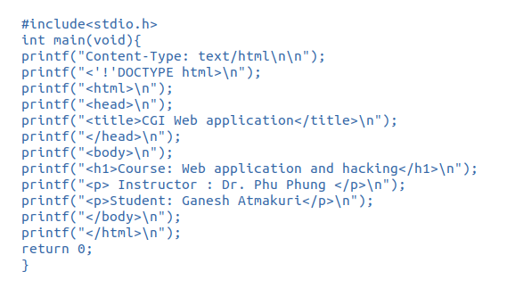 		
 
	
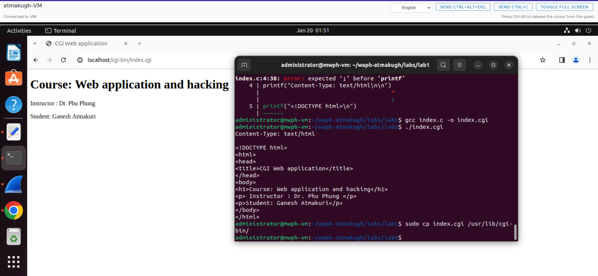 

## Task 2 - Simple PHP web application

- a. Now a simple php application need to be created. We need to install the php and configure it first to work with the apache web server.
- This can be done by installing using *sudo apt-get install php libapache2-mod-php -y*
- Create a php file and write a required code inside it.
- Copy the php file inside /var/www/html to deploy
- Open the browser and give the localhost/helloworld.php to run the php page.  

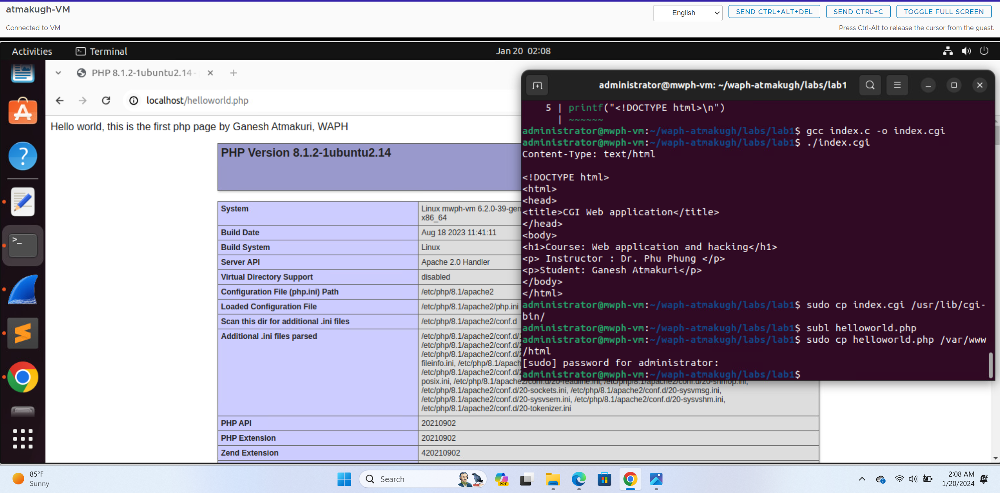 

- b. A second php web application 
- Write a required code in echo.php with in php tags and a $_REQUEST method
- Copy the echo file inside /var/www/html
- Open the browser and give the localhost/echo.php to run the php page and give the input data = data to print the content.  

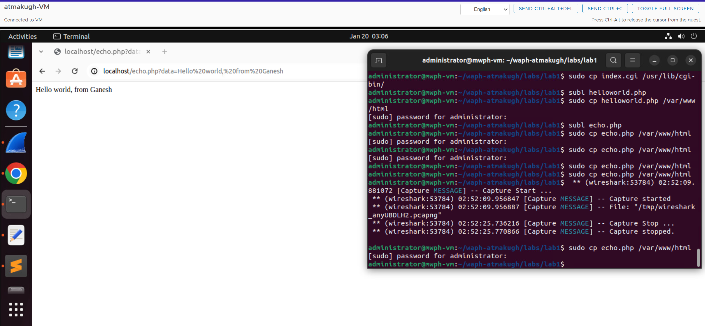 

- Program:

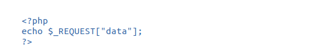

- There are few security concerns by deploying php web application. Major concerns by input validation and file uploads.
- Attackers may steal the information using different attacks.
- So it is important to maintain security constraints by updating php and using secured methods.

## Task 3 - Understanding HTTP GET and POST requests

- a. Analyzing the http request and response message using wireshark
- Before, running the php code, start capturing the packets in wireshark
- Go to the terminal and deploy the program
- After run the localhost link in browser with the input data given and then stop capturing the packets
- Observe http request and response message by clicking on show packet in new window  

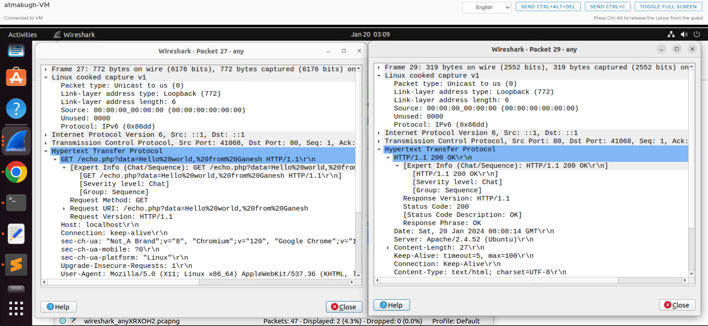 

- b. Curl is used to test the php page with post request
- First we need to install the curl using *sudo apt install curl*
- Type the request in the terminal by giving the command *Curl -X POST http://localhost/echo.php -d "data="Hello world,from Ganesh"*
- The terminal will display the http response after the POST request  

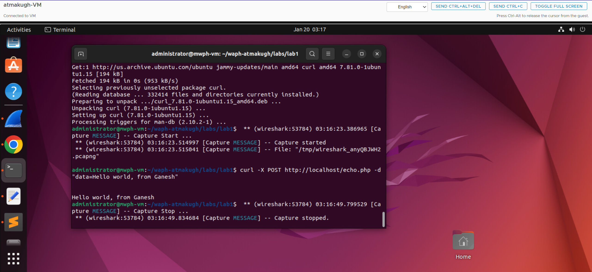 

- Also, analyze it in wireshark HTTP stream to clearly understand the http request and response  

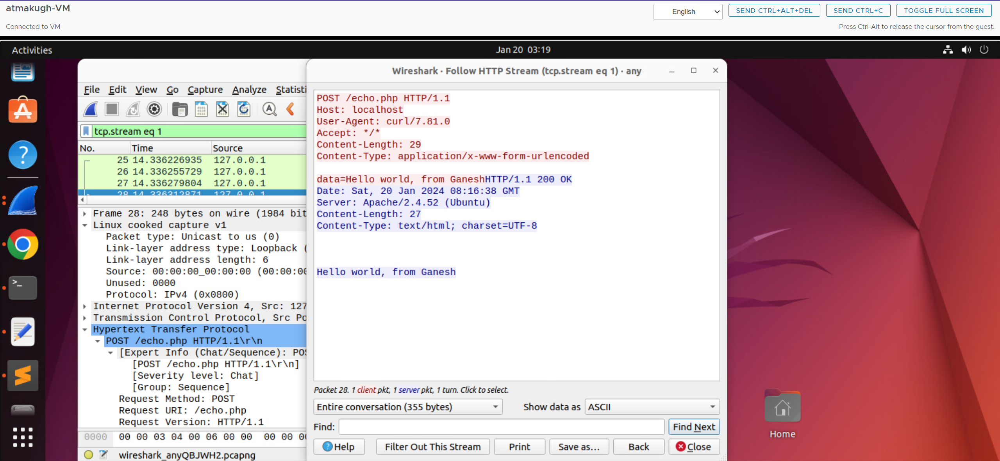 

- c. **HTTP GET REQUEST vs HTTP POST REQUEST**
- GET request is easily identified in URL 
- Where as POST request is not seen in url it is hidden
- But still we can analyze the source code
- Generally, GET is used to retrieve remote data where as POST is used to insert/update the data.
- If we observe http responses in wireshark and in terminal, almost every field observed is same.

 

