# waph-atmakugh
# WAPH-Web Application Programming and Hacking

## Instructor: Dr. Phu Phung

## Student

**Name**: Atmakuri Ganesh

**Email**: atmakugh@mail.uc.edu

**Short-bio**: A masters student with communication,organizational, and technical skills seeking opportunities. A hand-working and motivated engineering student with authentic skills in user application development and design thinking,dedicated to levaraging my abilities as a capable and diligent student  

 

 
## Lab Overview 

- This lab covers Frontend web development
- Task 1 primarly focuses on developing simple html web page with basic tags
- This lab also covers using echo.php to handle GET and POST requests
- Task 1 also covers using inlined and external javascript 
- Task 2 covers about the ajax, CSS, jquery, and web api integration
- Types of CSS is also covered in CSS
- Fetch(), JSON(), async, await functions are seen in the Task 2 

## Repository Information

Respository's URL: [https://github.com/ATMAKURIGANESH3009/waph-atmakugh/tree/main/labs/lab2](https://github.com/ATMAKURIGANESH3009/waph-atmakugh/tree/main/labs/lab2)

## Task 1 - Basic HTML with forms and and Javascript

- **A.HTML**
- In this task, I have developed a basic html code with basic tags and forms
- After creating a lab2 folder. I have created a waph-atmakugh.html and written html code inside it.
- It contains course name, instructor id, student details, student headset using h and img tag
- Next, I have developed a form with HTTP get request
- In this, I have used echo.php file which was generated in the last lab for the request purpose
- Similarly, I have createed a code for POST request using form tag
- Code for this task: 

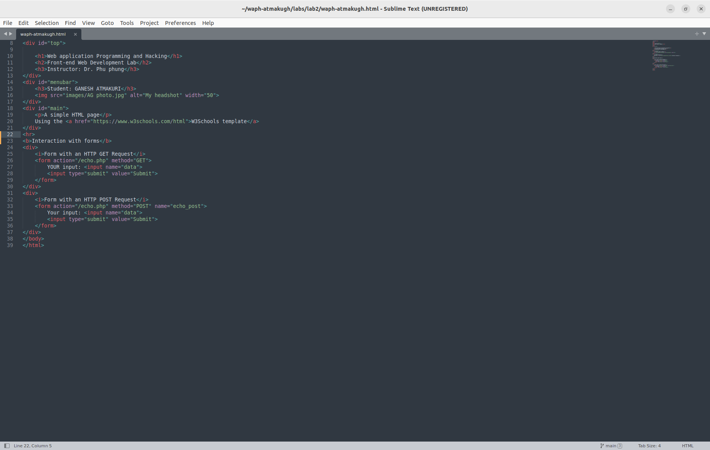 

- The output of this task looks as here: 

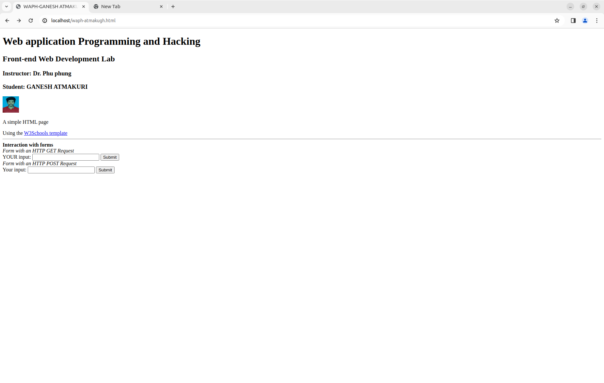 

- **B.Simple Javascript**
- After the forms, I have performed a inline javascript exercise. If I click on show the date it will display the current date
- In a div tag onclick="document.getElementById('date').innerHTML=Date() includes a functionality to display the date. 

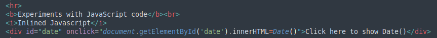 

- Next task is to creat digital clock as well as analog clock
- I developed a function to display clock and I have set the interval to change the time every 500ms 

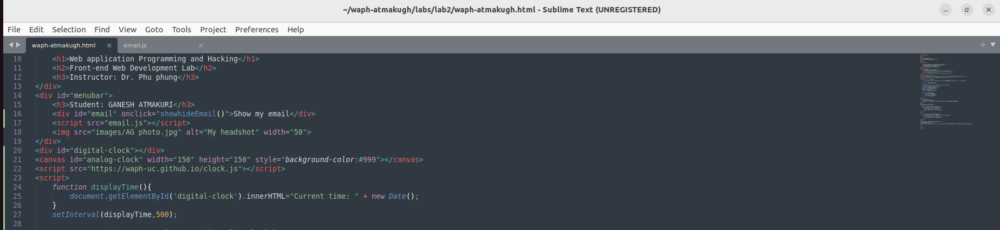 

- Next I written a code to show my email id when I clicked on show my email
- For this, I have included javascript code inside a new file "email.js" 

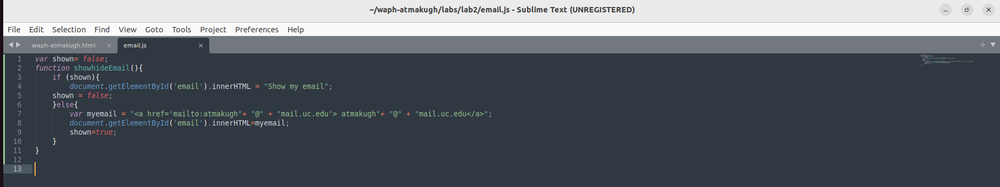 

- Also, I included a external javascript file "clock.js" and included a code inside the same script tag
- I used canvas to draw the clock image and a functions to draw the clock  

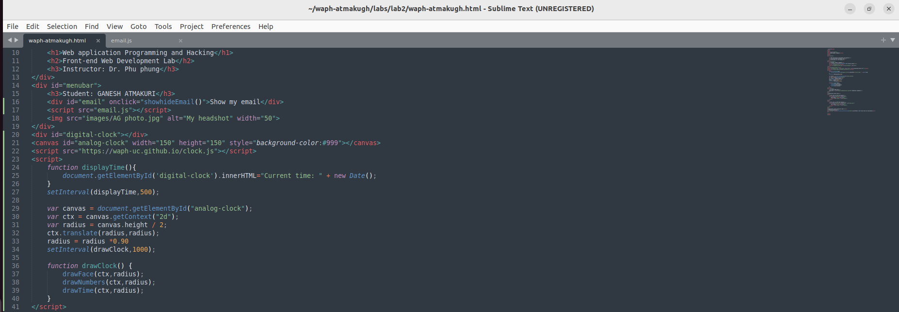 

- Total combined code for Task 1: 

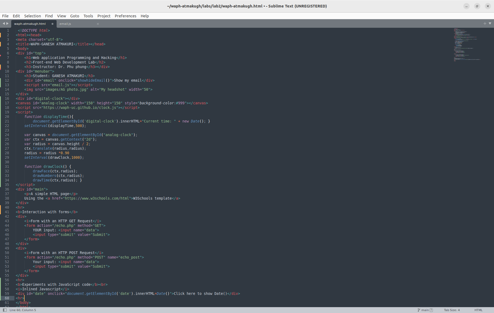 

- Output for Task1: 

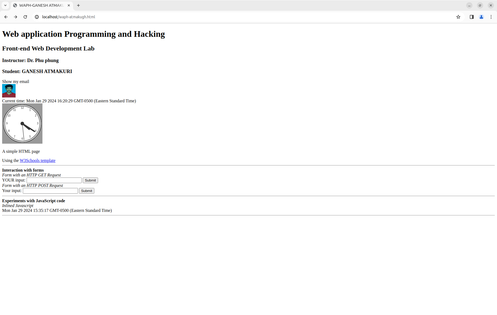 

## Task 2 - Ajax, CSS, jQuery and web API integration

- **A.Ajax**
- Ajax stands for Asynchronous Javascript and XML
- It is a standard for data to be collected in JS for the web browser to send/receive data from the web without reloading the page
- I added a input tag for taking the user input and a button for submitting the request and a div element to write the JS code. All together after the form. 
- I have written a function called getEcho() which takes the input and checks if the length of the input is zero or not to process the request
- Next, a new ajax object is created and onreadystatechange function is set up.
- If the ready state is 4 and status is 200 it will print the response text after handling the request
- A code is written to create an ajax request and sending the request to the server
- echo.php file handles the GET request initialized by xhttp.open 
- Code for the getecho function: 

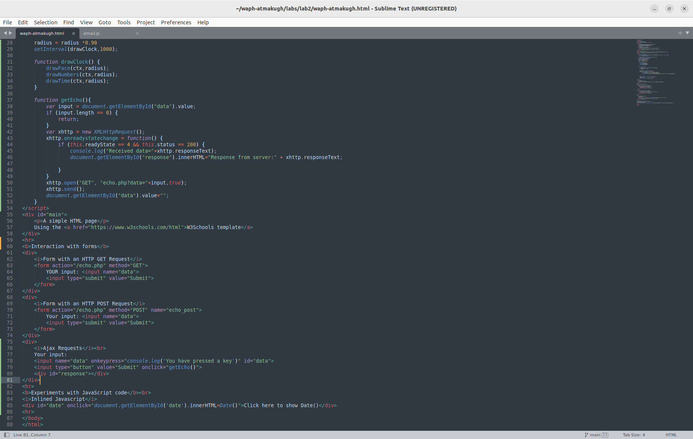 

- Output of the ajax response: 

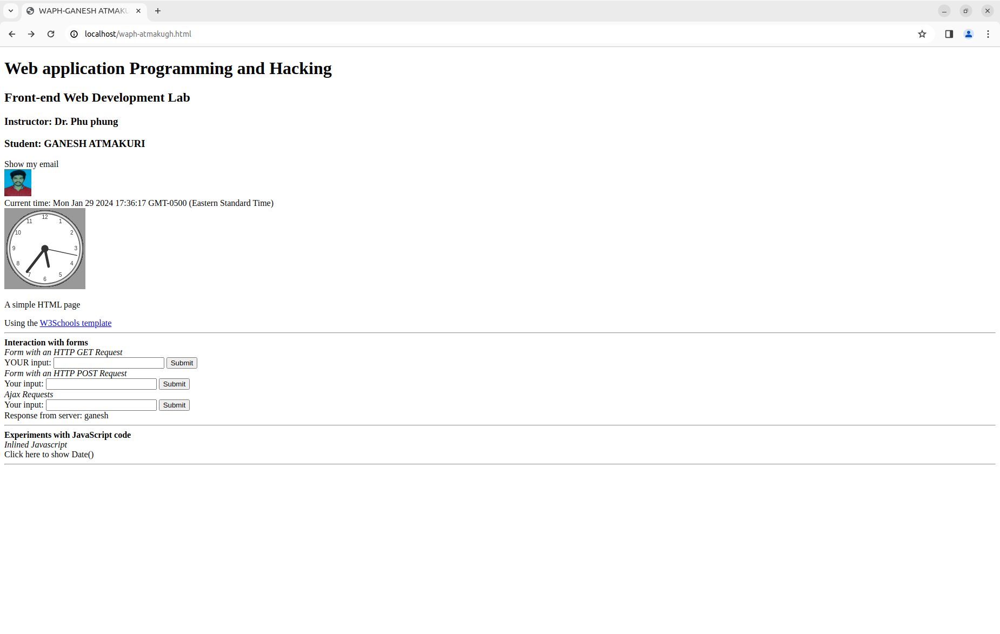 

- I have noticed how the ajax request/response showing in the network window
- When I started a new capture, after entering the text in the field and when the request is submitted then I can see there is a response printing in a console window as Response + ourtext
- When I inspect through the echo.php response it shows the status code as 200
- Each time when I ran the request the response message is changing in the console and the number of times the request executed is changing
- We can also see if there are any errors  

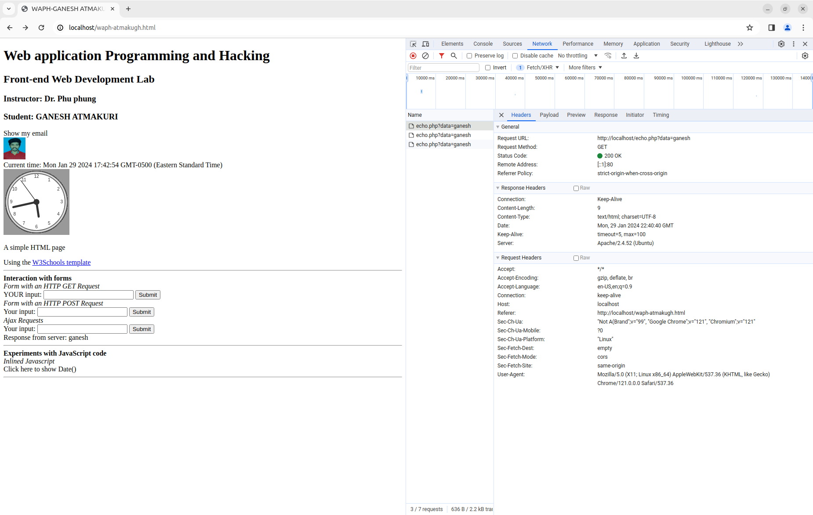 
 
- **B.CSS**
- External CSS:
- External CSS is giving a external style sheet in our html page. In this CSS code is written in external css file and the output is rendered for the html page
- I have included one of the remote CSS provided in the class to my page in the head tag
- Next, I made changes to my code accordingly with the div class related to the external CSS file. I arranged diffrerent div tags inside a main div tag container wrapper
- Code and rendered output: 

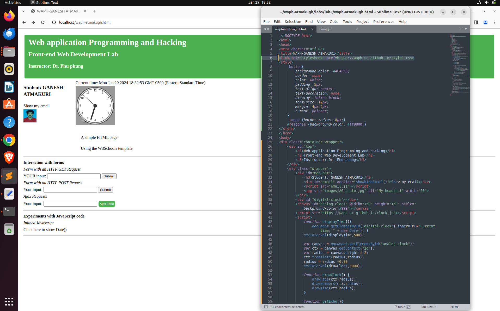

- Internal CSS:
- I have added a style tag in the head tag as an internal css
- I edited background color of body to powder blue and h1 tag color to blue 

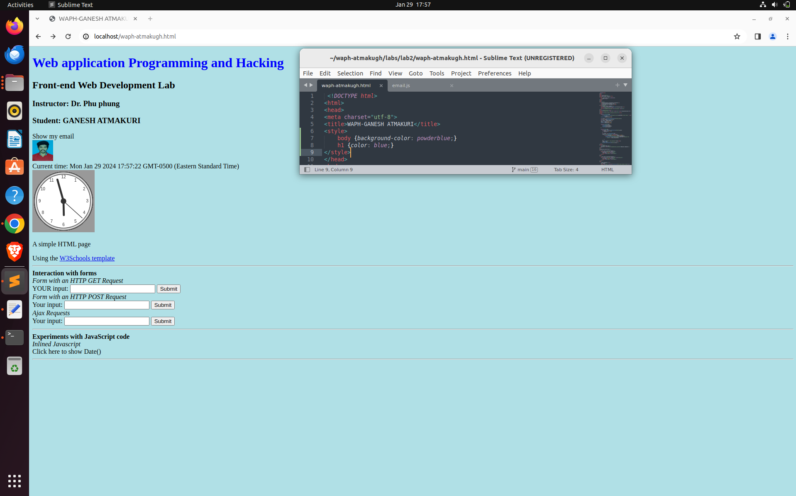

- Next, I removed the code and defined a style for ajax request button in the head tag as an internal css
- Added the class name to the ajax input button and changed the value from submit to Ajax Echo 
- Code and output: 

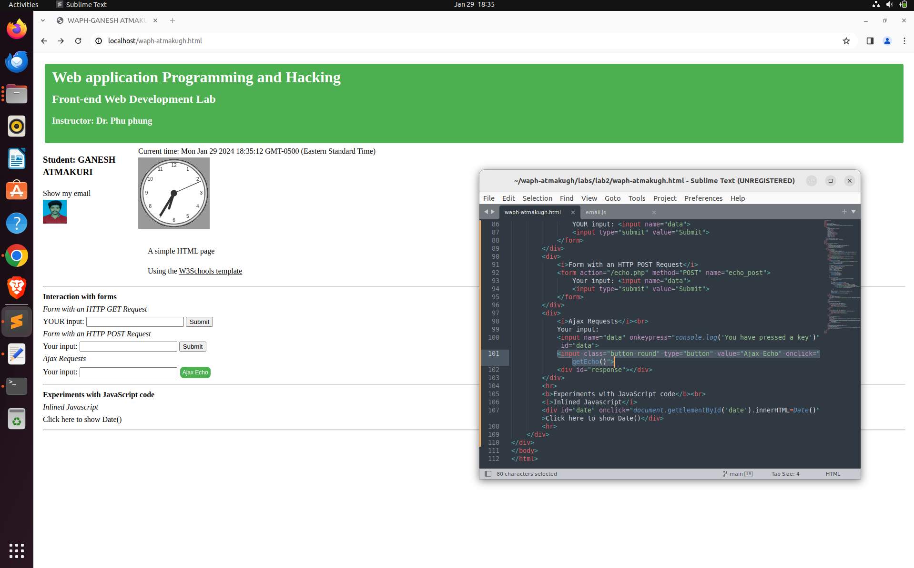

- **C.jQuery**

- jQuery is a popular javascript library that provides easy way to access APIs and working on it. Particularly it can simplify the complex tasks.
- I copied the jquery script code into the head section. It is required for the jquery to run
- **i.jQuery $.get():** 
- First a new button is added at the bottom to call the function jQueryAjax() when it is clicked
- A new function jQueryAjax() is created for an ajax get request and it will prints the response back
- Data which we entered is fetched in a variable. A general test is performed whether the data is empty or not by length function
- Next, jQuery selector gets the echo.php file and it reads the input from the container and print back the response by selecting #response id
- Code is as follows: 

 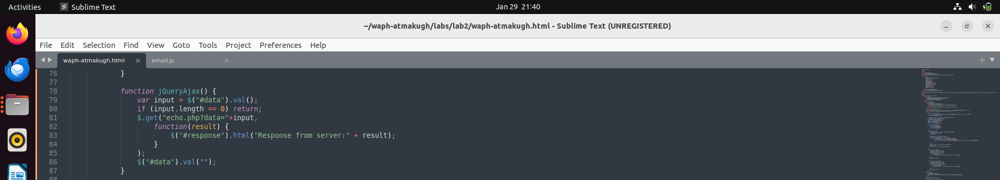
 
 
- **ii.jQuery $.post():** 

- A new button is added similarly like above at the bottom to call the function jQueryAjaxPost() when it is clicked
- A new function jQueryAjaxPost() is created for an ajax post request and it will prints the response back
- Data which we entered is fetched in a variable. A general test is performed whether the data is empty or not by length function
- Next, jQuery selector gets the echo.php file and it reads the input from the container and print back the response by selecting #response id
- Code is as follows: 

 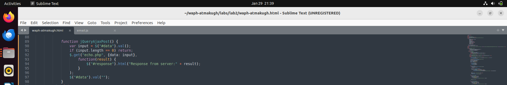
 
 - **D. Web API integration**
 
 - We can integrate any free APIs inside our html page using jQuery.
 - **i.Ajax on API:** The idea of this is to integrate a joke api by sending a request and to display the response of a random joke
 - A ajax request code is written in an old script tag
 - $.get()fetches the api for the response and JSON is used for formatting the response data
 - There is no button created for handling the joke. Therefore this request will execute everytime when the page is reloaded. 
 - code and output: 
 
 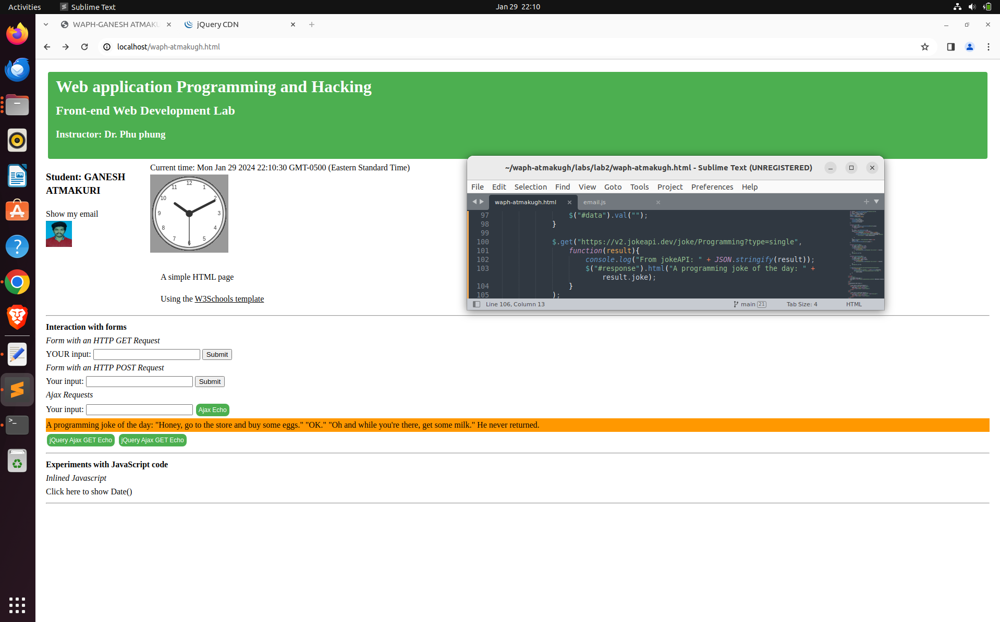
 
 - After refreshing a browser, I have inspected the network window
 - Everytime, when a browser is reloaded a random joke is fetched and printed in the console window as API code
 - In request windows, status is showing as 200 ok and in the response tab, it is displaying the api code which is fetched 
 
 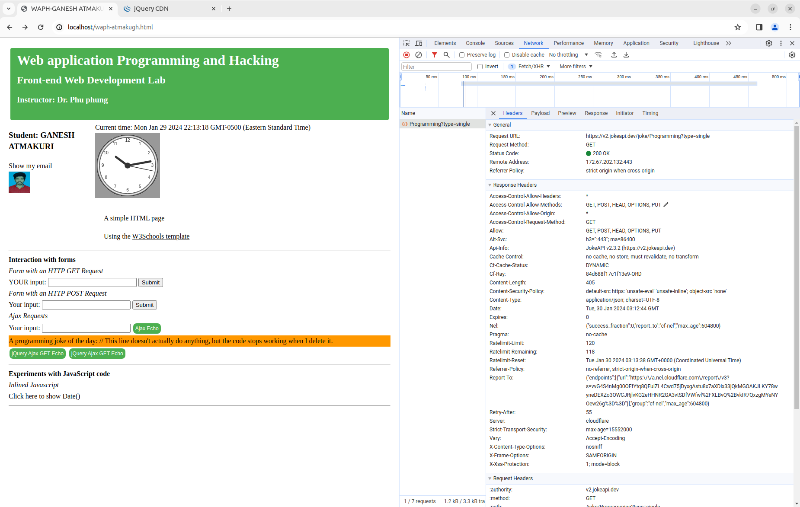
 
 -**ii.Using fetch api:** 
 
 - Guessing the age based on name is an another api I have fetched in this sub task
 - I have created a input button guess age to execute an api when the button is clicked
 - Next I have created a async function guessAge
 - I used fetch() which is a javascript method for fetching results across the network
 - It will return a promise
 - Now the api will respond and code will handle the response 
 - Code and output: 
 
 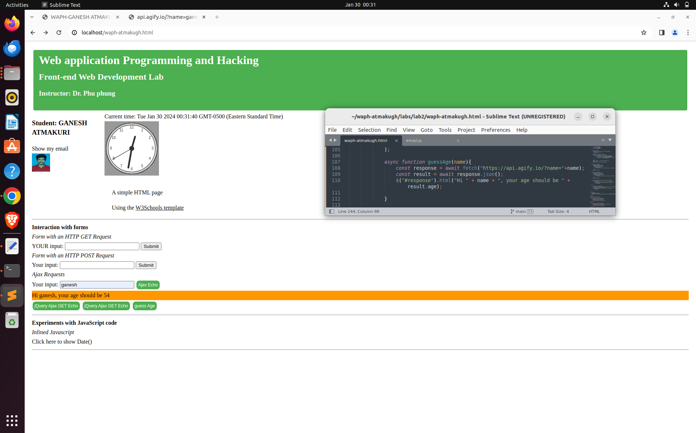
 
 - Next, I have inspected the network windows for the response 
 - It shows 200 ok and in response window it fetches the output in an api code 
 
 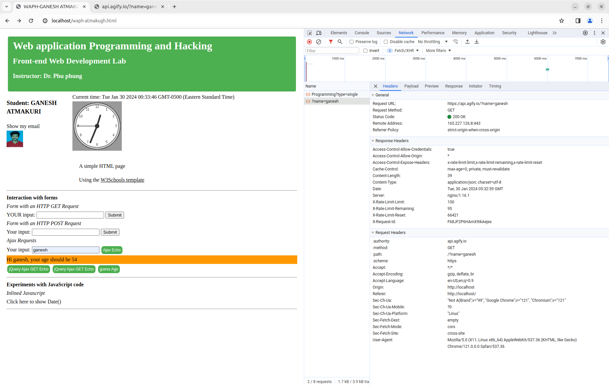
 
 

